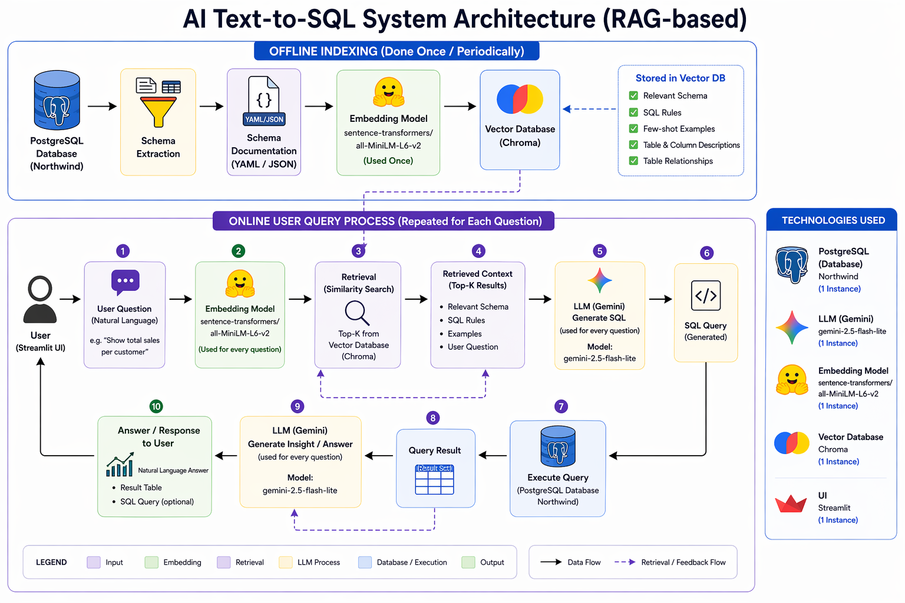

# 🧠 Smart Text-to-SQL Assistant

A powerful and intuitive natural language interface for relational databases.  
This project leverages **Google Gemini (LLM)** and **Retrieval-Augmented Generation (RAG)** to convert natural language queries into accurate **PostgreSQL SQL queries** and generate insights from the results.

---

## ✨ Features

- **Natural Language to SQL**  
  Convert user questions into SQL queries automatically using LLM (Gemini).

- **RAG-Based Schema Retrieval**  
  Retrieves relevant database schema using embeddings (*sentence-transformers*) and **Chroma vector database** to improve query accuracy.

- **Schema-Aware Query Generation**  
  Uses retrieved schema context to ensure correct table joins and valid column usage.

- **End-to-End Pipeline**  
  From user input → embedding → retrieval → SQL generation → query execution → insight generation.

- **Insight Generation**  
  Converts query results into human-readable explanations using LLM.

- **Interactive UI**  
  Built with **Streamlit** to display:
  - Generated SQL query  
  - Query results (table format)  
  - Natural language insights  

---

## 🏗️ System Architecture



### 🔵 Offline Phase
- Schema extraction from PostgreSQL  
- Schema documentation  
- Embedding generation using `sentence-transformers`  
- Storage in **Chroma Vector Database**

### 🔴 Online Phase
- User query input  
- Query embedding  
- Retrieval of relevant schema (RAG)  
- SQL generation using Gemini  
- Query execution on PostgreSQL  
- Insight generation from results  

---

## 🛠️ Technology Stack

- **LLM**: Google Gemini (gemini-2.5-flash-lite)  
- **Embedding Model**: sentence-transformers/all-MiniLM-L6-v2  
- **Vector Database**: Chroma  
- **Database**: PostgreSQL  
- **Dataset**: Northwind (https://github.com/pthom/northwind_psql)  
- **Framework**: LangChain  
- **Backend**: Python (psycopg2)  
- **Frontend**: Streamlit  

---

## 🚀 Getting Started

### Prerequisites

- Python 3.10 or higher  
- PostgreSQL installed and running  
- A **Google Gemini API Key** ([Get it here](https://aistudio.google.com/api-keys))  

---

### Installation

1. **Clone the Repository**
```bash
git clone <your-repo-url>
cd Text2Sql
````

2. **Set Up Virtual Environment**

```bash
python -m venv .venv
source .venv/bin/activate  # Windows: .venv\Scripts\activate
```

3. **Install Dependencies**

```bash
pip install -r requirements.txt
```

4. **Configure Environment Variables**
   Create `.env` file:

```env
GOOGLE_API_KEY=your_gemini_api_key
DB_HOST=localhost
DB_PORT=5432
DB_NAME=northwind
DB_USER=postgres
DB_PASSWORD=your_password
```

---

## 📦 Database Initialization

Before running the app, index your database schema:

```bash
python -m src.indexing
```

This will:

* Extract schema
* Generate embeddings
* Store them in Chroma

---

## 🖥️ Run the Application

```bash
streamlit run app.py
```

Open:

```
http://localhost:8501
```

---

## 💡 Example Queries

Try asking:

* "Show top 5 customers by total sales"
* "List all orders in 2023"
* "Which products have the highest sales?"
* "Total revenue per country"

---

## 📂 Project Structure

```text
.
├── app.py
├── src/
│   ├── chains.py
│   ├── database.py
│   ├── indexing.py
│   └── __init__.py
├── data/
│   ├── schema_docs.yaml
│   └── chroma_db/
├── requirements.txt
└── .env
```

---

## 🛡️ Security Note

* The system is designed for **read-only query generation**
* Avoid executing destructive queries
* Always use limited-access database credentials in production

---

## 🚀 Summary

This project demonstrates how **RAG enhances Text-to-SQL systems** by providing relevant schema context to LLMs, resulting in more accurate, reliable, and explainable SQL queries.

---

